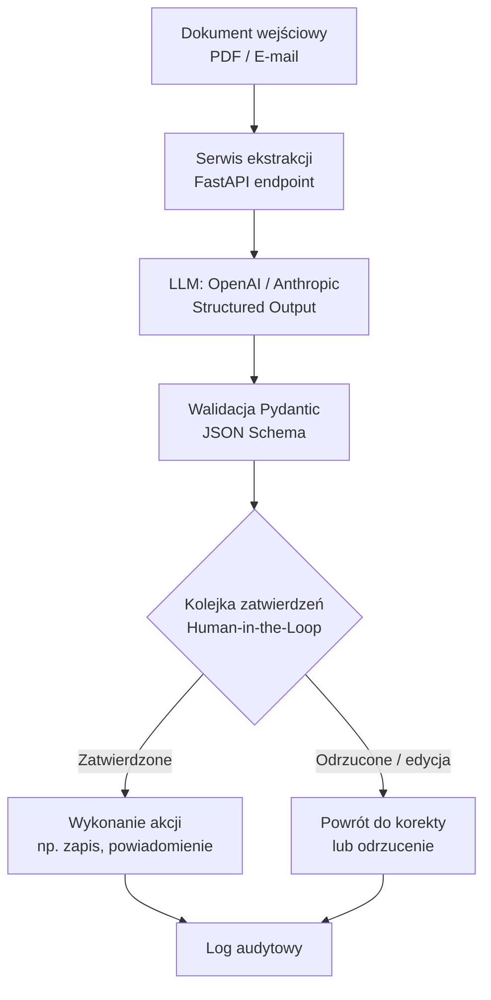

# Human-in-the-Loop AI Document & Task Processor


Automatyzacja przetwarzania dokumentów biznesowych (PDF / e-mail) za pomocą LLM
ze **structured outputs** (Pydantic / JSON Schema), z obowiązkową bramką
**zatwierdzenia przez człowieka (Human-in-the-Loop)** przed wykonaniem
jakiejkolwiek akcji.

## 💼 Business Value

Firmy automatyzujące obieg dokumentów (faktury, zgłoszenia, e-maile klientów)
stają przed dylematem: pełna automatyzacja LLM jest szybka, ale ryzykowna —
błąd modelu może wygenerować nieprawidłową akcję (np. błędną kwotę do zapłaty,
złą kategorię zgłoszenia). Ten projekt pokazuje wzorzec **AI-assisted, human-
approved automation**:

- **Szybkość LLM** — dokument jest automatycznie analizowany i zamieniany na
  ustrukturyzowane dane (Pydantic Structured Outputs), gotowe do dalszego
  przetwarzania.
- **Bezpieczeństwo procesu** — żadna akcja (np. zaksięgowanie, odpowiedź,
  eskalacja) nie wykonuje się automatycznie. Człowiek widzi propozycję modelu
  i ją zatwierdza, edytuje lub odrzuca.
- **Audytowalność** — każda decyzja (modelu i człowieka) jest rejestrowana,
  co ułatwia zgodność (compliance) i debugowanie.

Efekt: redukcja czasu ręcznego przetwarzania dokumentów przy zachowaniu pełnej
kontroli i odpowiedzialności po stronie człowieka.

## 🔄 Przepływ danych (Data Flow & Human Verification)



## 🚀 Quick Start

```bash
# 1. Klonowanie repozytorium
git clone https://github.com/<twoj-user>/projekt-ai-automatyzacja.git
cd projekt-ai-automatyzacja

# 2. Środowisko wirtualne
python -m venv .venv
.venv\Scripts\activate        # Windows
# source .venv/bin/activate   # Linux / macOS

# 3. Instalacja zależności
pip install -r requirements.txt

# 4. Konfiguracja zmiennych środowiskowych
cp .env.example .env
# uzupełnij klucze API (OpenAI i/lub Anthropic)

# 5. Uruchomienie serwera deweloperskiego
uvicorn src.api.main:app --reload

# 6. Testy
pytest
```

## 🗂️ Struktura projektu

```
src/
├── api/        # Endpointy FastAPI
├── core/       # Konfiguracja, logowanie, wyjątki
├── models/     # Schematy Pydantic (structured outputs)
└── services/   # Logika biznesowa (ekstrakcja, kolejka HITL)
tests/          # Testy pytest
```

Szczegółowe zasady pracy i konwencje kodowania: zobacz [CLAUDE.md](CLAUDE.md).

## 🛠️ Stack

FastAPI · Pydantic v2 · Uvicorn · OpenAI API / Anthropic API · pytest

## 📄 Licencja

MIT
